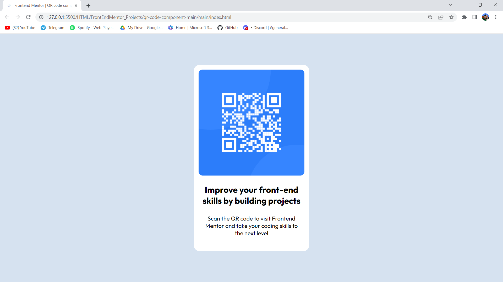
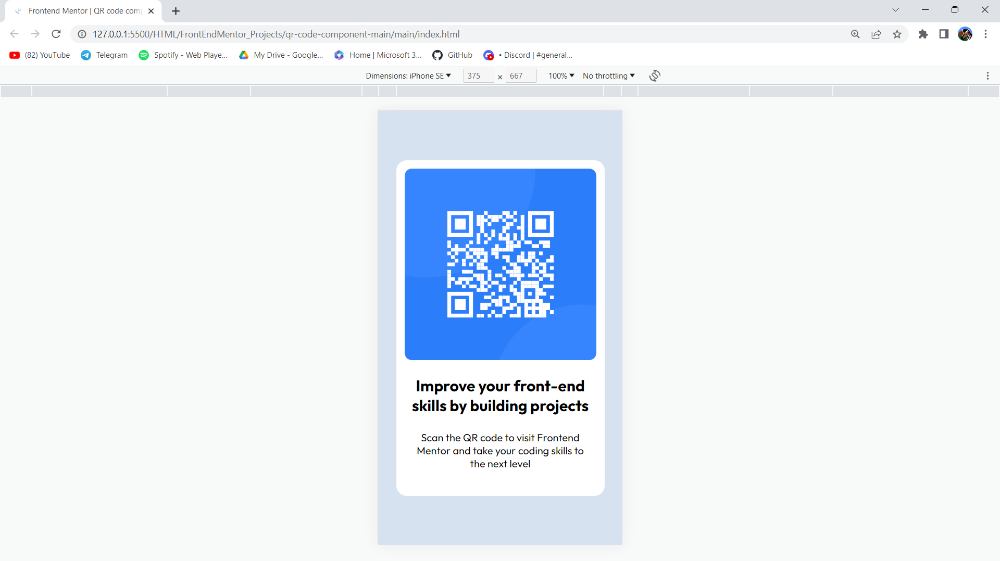

# Frontend Mentor - QR code component solution

This is a solution to the [QR code component challenge on Frontend Mentor](https://www.frontendmentor.io/challenges/qr-code-component-iux_sIO_H). Frontend Mentor challenges help you improve your coding skills by building realistic projects. 

## Table of contents

  - [Overview](#overview)
  - [Screenshot](#screenshot)
  - [Links](#links)
  - [Built with](#built-with)
  - [Author](#author)

## Overview
I was learning Web Dev for a long time but didn't had any projects to practice on...But thanks to FEM! This is my first FEM Project I am creating.

### Screenshot

### Links

- Solution repository over GitHub: https://github.com/varuno3/FEM-QRCodeComponent.git

### Built with

- Semantic HTML5 markup
- CSS custom properties
- Flexbox
- CSS Grid
- Mobile-first workflow

## Author

- Name - Varun Badoni (varunbadoni987@gmail.com)
- Frontend Mentor - [@varuno3](https://www.frontendmentor.io/profile/varuno3)

